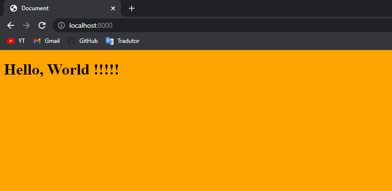

<h1>Fast Project</h1>

<p align="center">
<a href="#view">Create a view</a> • 
<a href="#commands">Commands</a> • 
<a href="#tips">Tips</a>
</p>

<h2>About</h2>

<p>Python package for better development process with Django using command line. The commands folder is a django app with commands of project, Fast folder have utils functions for fast development with Django</p>

<h2>How to start Django project with Fast Project</h2>

<ol>

<li>
<h3>Start virtual environment and Django project</h3>

```
python -m venv venv
```

```
venv/Scripts/Activate.ps1 # if PowerShell
```

```
pip install django
```

```
mkdir project
```

```
cd project
```

```
django-admin startproject MY_PROJECT_NAME .
```

</li><br>

<li>
<h3>Copy folders and files of project folder from this project and paste in your project folder, download <a href="./project.rar" type="application/rar" download="project.rar">here</a></h3>
</li><br>

<li>
<h3>Download requirements.txt and update requirements.txt</h3>

```
pip install -r requirements.txt
```

```
pip freeze > requirements.txt
```

</li><br>

<li>
<h3>Add project name and commands app in settings.py</h3>

```
# settings.py

PROJECT_NAME = 'MY_PROJECT_NAME'

INSTALLED_APPS = [
    ...,
    'commands.CommandsConfig',
]
```

</li><br>

<li>
<h3>Create project structure</h3>

```
python manage.py fast-init --del
```

</li><br>

</li><br>

<li>
<h3>Create custom user</h3>

```
python manage.py create-accounts-app
```

</li><br>

<li>
<h3>Edit user model and user admin</h3>
</li><br>

<li>
<h3>Do the migrations</h3>

```
python manage.py makemigrations
```

```
python manage.py migrate
```

</li><br>


</ol>

<h2 id="view">Create a view</h2>

<ol>


<li>
<h3>Create a app</h3>

```
python manage.py create-fast-app core
```

</li><br>


<li>
<h3>Create a view in backend/core/views.py</h3>

```
from django.shortcuts import render, redirect


BP = 'pages' # base path


def index(request):
    return render(request, f'{BP}/index.html')
    
```

</li><br>

<li>
<h3>Create a index.html in frontend/templates/pages</h3>

```
<link rel="stylesheet" href="/static/styles/pages/index.html">
<h1>Hello, World !!!!!</h1>
```

</li><br>

<li>
<h3>Create a index.css in frontend/static/styles/pages</h3>

```
body {
    background-color: orange;
}
```

</li><br>

<li>
<h3>Register route</h3>

```
# project/PROJECT_NAME/urls.py

urlpatterns = [
    path('admin/', admin.site.urls),
    path('', include('backend.core.urls'))
]

# project/backend/core/urls.py

urlpatterns = [
    path('', index, name='index'),
]
```

</li><br>


<li>
<h3>Run project</h3>

```
python manage.py runserver
```

</li><br>

<li>
<h3>View result in <a href="http://localhost:8000">http://localhost:8000</a></h3>



</li><br>


</ol>


<h2  id="commands">Commands</h2>

<ul>

<li>
<h3>fast-init [--del, -d]</h3>
<p>--del, -d  -> For delete default commentaries</p>
<p>Command for create project structure and configure project</p>
</li><br>

<li>
<h3>create-fast-app [app_name]</h3>
<p>Command for create fast app in backend folder</p>
</li><br>

<li>
<h3>create-accounts-app</h3>
<p>Command for create fast app with custom user</p>
</li><br>


<li>
<h3>register admin [model_address]</h3>
<p>model_address -> app_name.model_name</p>
<p>Command for create base for register admin model</p>
</li><br>

<li>
<h3>minificate-css [path]</h3>
</li><br>

<li>
<h3>minificate-html [path]</h3>
</li><br>

<li>
<h3>minificate-js [path]</h3>
</li><br>


</ul>

<h2  id="tips">Tips</h2>

<ul>

<li>
Create project name with uppercase, app name with lowercase and others with Casefold
</li><br>

<li>
Use 2 code softwares on backend and frontend folders, or 3 adding source folder.
</li><br>

</ul>